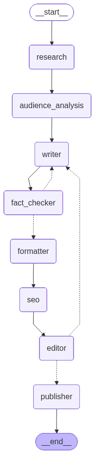

# LangGraph Blog Generation System

An automated blog post generation system built with LangGraph, LangChain, and Claude AI. This system generates comprehensive, SEO-optimized blog posts and publishes them to Ghost CMS.

## Features

- **Automated Research**: Uses Brave Search API to gather current information and generate headline candidates
- **Audience Analysis**: Identifies target reader persona, pain points, and content angle before writing
- **AI-Powered Writing**: Generates comprehensive 3,500+ word articles with compelling hooks, storytelling, and authentic voice
- **Tone Presets**: Choose from built-in tone presets (`conversational`, `expert_casual`, `storyteller`, `practical`, `thought_leader`) or define your own
- **Custom Instructions**: Provide per-article instructions to guide the content direction
- **SEO Optimization**: Automatically optimizes content for search engines with excerpt support
- **Ghost CMS Integration**: Publishes directly to Ghost CMS with full metadata (title, excerpt, meta description, tags)
- **Editor Approval Gate**: LLM-based editorial review scoring cohesiveness, hook quality, storytelling, and authentic voice
- **Revision Loop**: Failed articles automatically route back to writer with specific, actionable feedback (max 3 attempts)
- **Forced Publishing**: Articles exceeding max revisions force-publish with editor's note explaining unresolved issues
- **Visual Recommendations**: Formatter suggests where to add images, charts, tables, and diagrams
- **Quality Assurance**: Built-in content quality checks (word count, inline links, structure, headings, sections)
- **Date-Aware Prompts**: All prompts receive the current date for timely, relevant content
- **Modular Architecture**: Clean, maintainable codebase using LangGraph
- **LangSmith Tracing**: Optional integration for debugging and monitoring

## Architecture

The system uses a LangGraph state graph with 7 nodes and an approval gate workflow:

```
Research → Audience Analysis → Writer → Formatter → SEO → Editor (Approval Gate)
                                  ↑                          ├─→ Approved → Publisher
                                  └──────────────────────────└─→ Rejected ↻ Writer (Revision Loop, max 3 attempts)
```

### Workflow Diagram



Each node performs a specific task and updates the shared state:

- **Research**: Gathers information via web search, generates headline candidates
- **Audience Analysis**: Identifies target reader persona, pain points, goals, and content angle
- **Writer**: Generates comprehensive article with hooks, storytelling, and authentic voice (or revises based on editor feedback)
- **Formatter**: Normalizes and formats content for readability
  - Fixes heading hierarchy (ensures exactly 1 H1)
  - Cleans up Markdown formatting and spacing
  - Analyzes content and suggests visual element placements (images, charts, tables)
  - Prepares content for SEO and editorial review
- **SEO**: Optimizes for search engines (title, description, excerpt, keywords, tags)
- **Editor**: Quality approval gate with rejection and revision loop
  - Scores cohesiveness, hook quality, storytelling, and authentic voice (0-10 each)
  - Checks mechanical requirements (word count, links, structure, H1, sections)
  - Provides specific, actionable feedback for revisions
  - Allows max 3 revision attempts before forced publishing
  - Sets approval status for conditional routing
- **Publisher**: Publishes to Ghost CMS with complete metadata

## Prerequisites

**Required:**
- Python 3.10+
- Anthropic API key (Claude) or OpenRouter API key
- Brave Search API key
- Ghost CMS instance with Admin API access

**Optional:**
- LangSmith API key (for tracing and debugging)

## Installation

1. **Clone the repository**
```bash
cd blogging-with-langchain
```

2. **Create virtual environment**
```bash
python -m venv venv
source venv/bin/activate  # On Windows: venv\Scripts\activate
```

3. **Install dependencies**
```bash
pip install -r requirements.txt
```

4. **Configure environment variables**

Create a `.env` file in the project root:

```env
# LLM Configuration (with automatic fallback)
# The system tries Anthropic first, falls back to OpenRouter if it fails
# At least one API key is required

# Primary: Anthropic Claude (recommended)
ANTHROPIC_API_KEY=your_anthropic_api_key
CLAUDE_MODEL=claude-3-5-sonnet-20241022
CLAUDE_TEMPERATURE=0.7

# Fallback: OpenRouter (used if Anthropic fails)
OPENROUTER_API_KEY=your_openrouter_api_key
OPENROUTER_MODEL=openai/gpt-4o

# Brave Search API
BRAVE_SEARCH_API_KEY=your_brave_search_api_key

# Ghost CMS
GHOST_API_KEY=your_ghost_admin_api_key
GHOST_API_URL=https://your-ghost-site.com
GHOST_AUTHOR_ID=your_author_id

# Optional: Customize settings
WORD_COUNT_TARGET=3500
MIN_INLINE_LINKS=10
PUBLISH_AS_DRAFT=true
```

## Usage

### Generate a Blog Post

```bash
python main.py "Your blog topic here"
```

**Examples:**
```bash
python main.py "AI and Machine Learning in Healthcare"
python main.py "Introduction to LangGraph and LangChain"
python main.py "Best Practices for Python Web Development"
```

### Customize Blog Tone

Override the default tone using built-in presets or a custom description:

```bash
# Use a preset
python main.py "Your topic" --tone "preset:conversational"
python main.py "Advanced Python Patterns" --tone "preset:expert_casual"
python main.py "AI Strategy Guide" --tone "preset:thought_leader"

# Or use a custom tone description
python main.py "Your topic" --tone "technical and detailed"
python main.py "Getting Started with AI" --tone "educational and accessible"
```

**Built-in tone presets:**
| Preset | Style |
|--------|-------|
| `preset:conversational` | Friendly and approachable, like a knowledgeable friend |
| `preset:expert_casual` | Knowledgeable yet informal, like a senior colleague |
| `preset:storyteller` | Narrative-driven, weaving real-world stories throughout |
| `preset:practical` | Direct, actionable, and results-focused |
| `preset:thought_leader` | Bold, opinionated, and forward-looking |

Or use any custom tone description (e.g., `"conversational and engaging"`, `"technical and detailed"`).

Set the default tone in your `.env` file:
```env
BLOG_TONE=conversational and engaging
```

### Add Custom Instructions

Provide additional guidance for the article generation:

```bash
python main.py "Machine Learning Basics" --instructions "Focus on practical Python examples for beginners"
python main.py "Advanced Python" -i "Target experienced developers, include performance considerations"
python main.py "Web Development" --instructions "Emphasize security best practices throughout"
```

Custom instructions are passed to multiple nodes:
- **Writer**: Influences article structure, focus, and tone
- **SEO**: Guides keyword selection and optimization strategy
- **Editor**: Informs editorial feedback and quality checks

### Visualize the Workflow

```bash
python main.py --visualize
```

This generates a visualization of the workflow graph showing all nodes and their connections.

### Enable Debug Mode

```bash
python main.py "Your topic" --debug
```

Displays detailed error traces and debugging information during execution.

## Project Structure

```
blogging-with-langchain/
├── config.py              # Configuration settings
├── state.py               # BlogState TypedDict (defines approval_status, revision_count, etc.)
├── graph.py               # LangGraph state graph definition with conditional routing
├── main.py                # Entry point
├── tools/                 # Custom tools
│   ├── brave_search.py    # Web search tool
│   ├── seo_analyzer.py    # SEO analysis
│   ├── html_formatter.py  # HTML/Markdown formatting
│   ├── ghost_cms.py       # Ghost CMS publishing
│   ├── tag_extractor.py   # Tag extraction
│   └── content_analyzer.py # Content quality analysis
├── prompts/               # Jinja2 prompt templates (all date-aware)
│   ├── research.txt       # Research planning + headline generation prompt
│   ├── audience_analysis.txt  # Target audience analysis prompt
│   ├── writer.txt         # Article writing prompt (hooks, storytelling, voice)
│   ├── revision.txt       # Article revision prompt (with editor feedback)
│   ├── seo.txt            # SEO optimization prompt
│   ├── formatter.txt      # Content formatting prompt
│   └── editor.txt         # Editor review prompt (4 scoring dimensions)
├── nodes/                 # LangGraph node functions
│   ├── prompt_loader.py   # Jinja2 prompt loading and caching utility
│   ├── research.py        # Research node + headline candidate generation
│   ├── audience_analysis.py  # Audience analysis node (persona, pain points)
│   ├── writer.py          # Writer node (handles initial write and revisions)
│   ├── seo.py             # SEO optimization node
│   ├── formatter.py       # Content formatting + visual recommendations
│   ├── editor.py          # Editor approval gate (cohesiveness, hook, storytelling, voice)
│   ├── publisher.py       # Publisher node with forced publish support
│   └── __init__.py
├── cloudflare-worker/     # Social media notification webhook
│   ├── worker.js          # Cloudflare Worker (serverless webhook)
│   ├── wrangler.toml      # Cloudflare configuration
│   ├── package.json       # npm dependencies
│   └── README.md          # Webhook setup guide
├── .github/
│   └── workflows/
│       └── deploy-worker.yml  # Auto-deploy webhook to Cloudflare
├── tests/                 # Unit tests
│   ├── test_tools.py
│   └── test_config.py
├── media/                 # Generated visualizations
│   └── blog_graph.png     # Workflow diagram
├── output/                # Generated blog posts
├── requirements.txt       # Python dependencies
├── .env                   # Environment variables (create this)
└── .gitignore
```

## Workflow Details

### 1. Research Node
- Performs 5-7 web searches using Brave Search API
- Collects 5-10 credible sources
- Generates research summary with source information
- Generates 5-7 headline candidates for the writer to choose from

### 2. Audience Analysis Node
- Identifies the primary reader persona (role, experience level, existing knowledge)
- Surfaces top 3 pain points that brought the reader to search for this topic
- Defines reader goals and desired outcomes
- Recommends content angle and engagement hooks
- Informs the writer to craft content tailored to the target audience

### 3. Writer Node
- Creates comprehensive 3,500+ word article
- **Structured with:** Introduction, 4 main sections, Conclusion
- **Hook requirements (first 2 sentences):**
  - Surprising statistics or facts
  - Thought-provoking questions targeting specific pain points
  - Relatable "you" scenarios
  - Bold, contrarian statements
  - Real-world stories mirroring the reader's struggle
- **Storytelling & Examples (minimum 2 per article):**
  - Concrete real-world examples and case studies
  - Before/after scenarios showing transformation
  - Specific, named examples (companies, tools, projects)
  - Examples that mirror the reader's likely situation
- **Authentic Voice:**
  - Conversational "you" language throughout
  - Honest acknowledgment of complexity
  - Natural rhythm with varied sentence lengths
  - No corporate jargon or filler phrases
- **Engagement strategies:**
  - Strategic bolding of key insights
  - Metaphors and analogies
  - Rhetorical questions
  - Short, scannable paragraphs (2-4 sentences max)
  - Mini-cliffhangers between sections
- **Features:** 10-15 inline citations, headline candidates from research, audience-tailored content
- **Custom instructions:** Applied to influence article direction and focus

### 4. SEO Node
- Generates SEO-optimized title (50-60 chars)
- Creates meta description (150-160 chars)
- **Generates article excerpt** (200-250 chars for listing pages)
- Extracts 5-8 relevant tags
- Identifies 3-5 primary keywords
- Calculates keyword density (targets 1.5-2%)
- **Custom instructions:** Guides keyword selection and optimization strategy

### 5. Formatter Node
- Formats content for Ghost CMS
- Ensures proper Markdown syntax
- Fixes heading hierarchy
- Normalizes spacing and line breaks
- Generates visual placement recommendations (hero images, comparison tables, workflow diagrams, charts, screenshots)

### 6. Editor Node (Approval Gate)

**Editorial Scoring (LLM-based, 0-10 each):**
- Cohesiveness & Flow (must score ≥ 7)
- Hook Quality (must score ≥ 7)
- Storytelling & Examples (must score ≥ 6)
- Authentic Voice (must score ≥ 6)

**Mechanical Requirements (must all pass):**
- ✓ Word count ≥ 95% of target
- ✓ Minimum 10 inline links
- ✓ Exactly 1 H1 heading
- ✓ At least 4 H2 sections

**Approval Paths:**
1. **✅ APPROVED**: All scores meet thresholds and mechanical requirements pass
   - Sets `approval_status: "approved"`
   - Routes to Publisher node

2. **❌ REJECTED + Revisions Available**: Scores or checks fail, attempts < 3
   - Sets `approval_status: "rejected"`
   - Provides specific feedback per dimension (hook, storytelling, voice, mechanics)
   - Increments `revision_count`
   - Routes back to Writer node with editor feedback
   - Writer uses `revision.txt` prompt with targeted guidance for each low-scoring dimension

3. **⚠️ FORCE PUBLISH**: Checks fail, revisions exhausted (≥ 3 attempts)
   - Sets `approval_status: "force_publish"`
   - Prepends editor's note with all scores and unresolved issues
   - Routes to Publisher node with forced note
   - Marks article with warning in logs

### 7. Publisher Node
- Checks for forced publish note and prepends if present
- Saves article to local `output/` directory with timestamp
- Removes H1 title from content (sent separately to avoid duplication)
- Publishes to Ghost CMS with complete metadata:
  - Title (SEO-optimized)
  - Content (formatted, with forced publish note if applicable)
  - Meta description
  - **Excerpt** (for listing pages)
  - Tags
- Publishes as draft or published based on `PUBLISH_AS_DRAFT` setting
- Returns post ID and URL
- Logs warnings if article was force-published

## Social Media Notification System

When a blog post is published to Ghost CMS (via Python script or Ghost admin UI), an automated notification system:

📧 **Sends you an email** with AI-generated social media post proposals:
- **LinkedIn post** - Professional tone, optimized for engagement (<3000 chars)
- **Bluesky post** - Conversational tone, concise format (<300 chars)

### How It Works

```
Blog Published → Ghost CMS → Ghost Webhook → Cloudflare Worker → Email
                                                     ↓
                                            Anthropic API
                                          (generates posts)
```

**Key Features:**
- ⚡ Serverless (Cloudflare Workers) - no server maintenance
- 🤖 AI-powered post generation using Claude
- 📧 Email delivery via Mailgun
- 🔄 Automatic for all published posts
- 🆓 Free tier available (100k requests/day)

### Setup

The notification system runs on Cloudflare Workers and requires:
1. Cloudflare account (free tier works)
2. Mailgun account (free tier: 5,000 emails/month)
3. Ghost CMS webhook configuration

**📖 Full setup guide:** [`cloudflare-worker/README.md`](cloudflare-worker/README.md)

## Running Tests

```bash
# Run all tests
pytest

# Run specific test file
pytest tests/test_tools.py

# Run with coverage
pytest --cov=. --cov-report=html

# Run with verbose output
pytest -v
```

## Configuration Options

All settings can be customized in `.env`:

| Variable | Default | Description |
|----------|---------|-------------|
| `WORD_COUNT_TARGET` | 3500 | Target word count for articles |
| `NUM_SECTIONS` | 4 | Number of main content sections |
| `BLOG_TONE` | informative and insightful | Writing tone and style |
| `MIN_INLINE_LINKS` | 10 | Minimum inline citations required |
| `TARGET_KEYWORD_DENSITY` | 1.5 | Target keyword density (%) |
| `PUBLISH_AS_DRAFT` | true | Publish as draft or published |
| `OUTPUT_DIR` | output | Local output directory |

## LangSmith Tracing (Optional)

LangSmith provides powerful tracing and debugging capabilities for your LangGraph workflows. With LangSmith, you can:

- 📊 **Visualize the entire workflow** - See each node execution in a timeline
- 🔍 **Inspect LLM calls** - View prompts, responses, and token usage
- ⏱️ **Track performance** - Monitor execution time for each node
- 💰 **Monitor costs** - Track API usage across runs
- 🐛 **Debug issues** - Replay runs and identify bottlenecks
- 📈 **Analytics** - Aggregate metrics across multiple runs

### Setup LangSmith

1. **Create a LangSmith account** at [smith.langchain.com](https://smith.langchain.com)

2. **Get your API key** from the LangSmith dashboard

3. **Add to your `.env` file:**
```env
# Enable LangSmith tracing
LANGCHAIN_TRACING_V2=true

# Your LangSmith API key
LANGCHAIN_API_KEY=your_langsmith_api_key_here

# Optional: Custom project name (defaults to "blog-generation")
LANGCHAIN_PROJECT=my-blog-project
```

4. **Run the system** - Tracing is now automatic!

```bash
python main.py "Your topic"
```

5. **View traces** at [smith.langchain.com](https://smith.langchain.com)

### What You'll See in LangSmith

Each blog generation run will show:

- **Research Node**: All web searches, sources gathered, headline candidates generated
- **Audience Analysis Node**: Target reader persona and pain point identification
- **Writer Node**: LLM prompt and full article generation (with audience context and headlines)
- **SEO Node**: SEO analysis, optimization, and excerpt generation
- **Formatter Node**: Content formatting transformations and visual recommendations
- **Editor Node**: Editorial scoring (cohesiveness, hook, storytelling, voice) and quality validation
- **Publisher Node**: Ghost CMS API calls

### Example Trace View

```
Blog Generation Run (4m 30s)
├── research_node (45s)
│   ├── BraveSearchTool: "AI trends" (3s)
│   ├── BraveSearchTool: "machine learning 2026" (2s)
│   └── LLM Call: Research summary + headlines (40s)
├── audience_analysis_node (20s)
│   └── LLM Call: Audience persona + pain points (20s)
├── writer_node (2m 15s)
│   └── LLM Call: Generate 3500 word article (2m 15s)
├── formatter_node (5s)
│   └── LLM Call: Format for Ghost CMS + visual suggestions (5s)
├── seo_node (20s)
│   └── LLM Call: SEO optimization + excerpt generation (20s)
├── editor_node (15s)
│   └── LLM Call: Score cohesiveness, hook, storytelling, voice (15s)
└── publisher_node (7s)
    └── GhostCMSTool: Publish with excerpt to CMS (7s)
```

### Disable LangSmith

To disable tracing, set in `.env`:
```env
LANGCHAIN_TRACING_V2=false
```

Or simply remove/comment out the LangSmith variables.

## Troubleshooting

### Configuration Errors

If you see configuration validation errors:
```
Configuration validation failed:
  - At least one LLM API key is required (ANTHROPIC_API_KEY or OPENROUTER_API_KEY)
```

Ensure your `.env` file has at least one LLM API key configured.

### API Rate Limits

- **Brave Search**: Free tier allows 2,000 queries/month
- **Anthropic**: Check your plan's rate limits
- **Ghost CMS**: Typically no rate limits for Admin API

### Quality Score Low

If quality scores are consistently low:
- Check that the LLM is generating full 3,500+ word articles
- Verify inline links are being included
- Ensure proper heading structure (1 H1, 4+ H2s)

## Cost Estimates

**Per blog post:**
- Claude 3.5 Sonnet via Anthropic: ~$0.15-0.30
- OpenRouter (Claude 3.5 Sonnet): ~$0.15-0.30
- Brave Search: Free (within limits)
- Ghost CMS: Varies by hosting

## Comparison to CrewAI Version

This LangGraph implementation provides:
- ✅ More explicit state management
- ✅ Better debugging and observability (LangSmith tracing)
- ✅ Simpler, more Pythonic code
- ✅ Easier to extend and customize
- ✅ Direct LangChain integration
- ✅ No CrewAI dependency overhead
- ✅ Built-in LangSmith support for monitoring and debugging

## Contributing

Contributions welcome! Please:
1. Fork the repository
2. Create a feature branch
3. Add tests for new functionality
4. Submit a pull request

## License

MIT License - feel free to use this project however you like!

## Acknowledgments

- Inspired by the [Blogging-with-CrewAI](https://github.com/christancho/Blogging-with-CrewAI) project
- Built with [LangChain](https://github.com/langchain-ai/langchain) and [LangGraph](https://github.com/langchain-ai/langgraph)
- Powered by [Anthropic Claude](https://www.anthropic.com/)

## Support

For issues or questions:
- Open an issue on GitHub
- Check the troubleshooting section above
- Review the example `.env` configuration

---

**Built with ❤️ using LangGraph and Claude**
